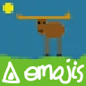

  

<h1 align="center">Legitimoose Figura Emoji Pack<h1>

<h2 align="center">
    Adds emojis from the hit server 
    <a href="https://store.legitimoose.com">legitimoose.com</a>
    into <a href="https://github.com/FiguraMC/Figura">Figura</a>.
</h2>

<h5 align="center">
    by 
    <a href="https://github.com/LegitiDevs">LegitiDevs</a>, formerly by 
    <a href="https://github.com/Trioplane">Trplnr</a>
</h5>

    

## Credits
- [Trplnr](https://github.com/Trioplane) - Author, Maintainer
- [Legitimoose Discord Server & Members](https://discord.gg/z3kqKDyvZY) - Emoji Source
- Moose People - Skin Emojis

